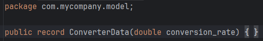
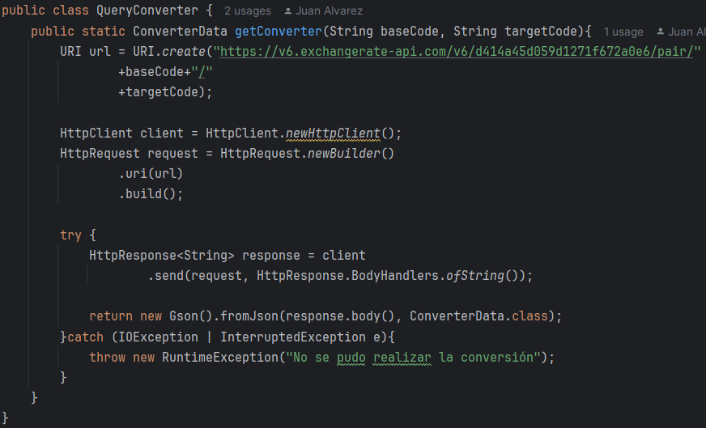
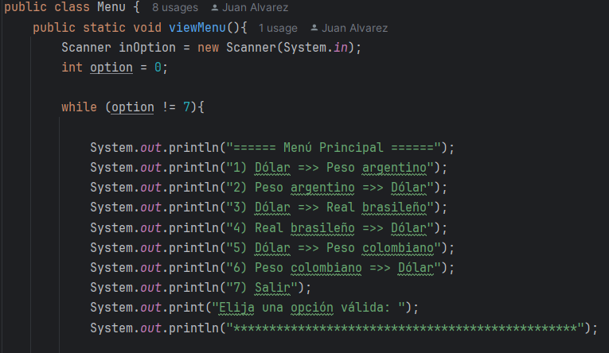
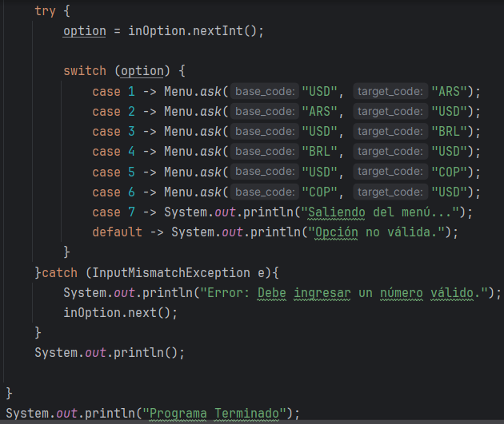
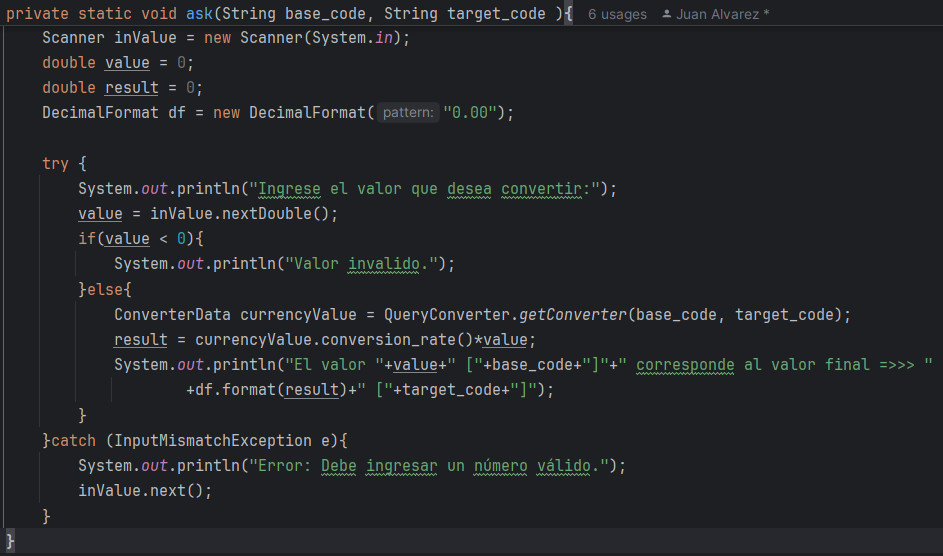
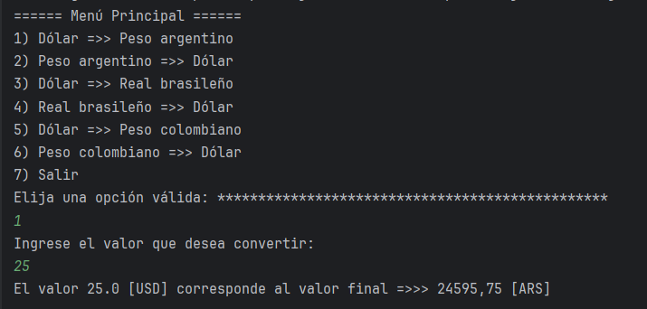

# ConverteApp

El siguiente programa es un convertidor de moneda, en el cual tenemos seis opciones para escoger.

El programa obtiene la tasa de cambio desde la API [ExchangeRate-API](https://www.exchangerate-api.com/).

## **Clases**

### **ConverterData**

Es el Record encargado de almacenar el dato del valor de la moneda.

### **QueryConverter**

Esta clase es la encargada de hacer la consulta en la API sobre la tasa de cambio de la moneda **baseCode** a la moneda **targetCode**, guardando el resultado en el Record **ConverterData**.

### **Menu**

Esta clase es la encargada de mostrar las opciones del cambio de moneda al usuario.

#### **Metodo ask**

Este metodo es el encargado de hacer el cambio de monedas dependiendo de la opcion que escoge el usuario.

### **Ejemplo de Funcionamiento**

Al correr el programa este muestra el anterior menu que nos permite realizar los cambio de moneda en la opciones, hasta que decidimos salir del programa.
